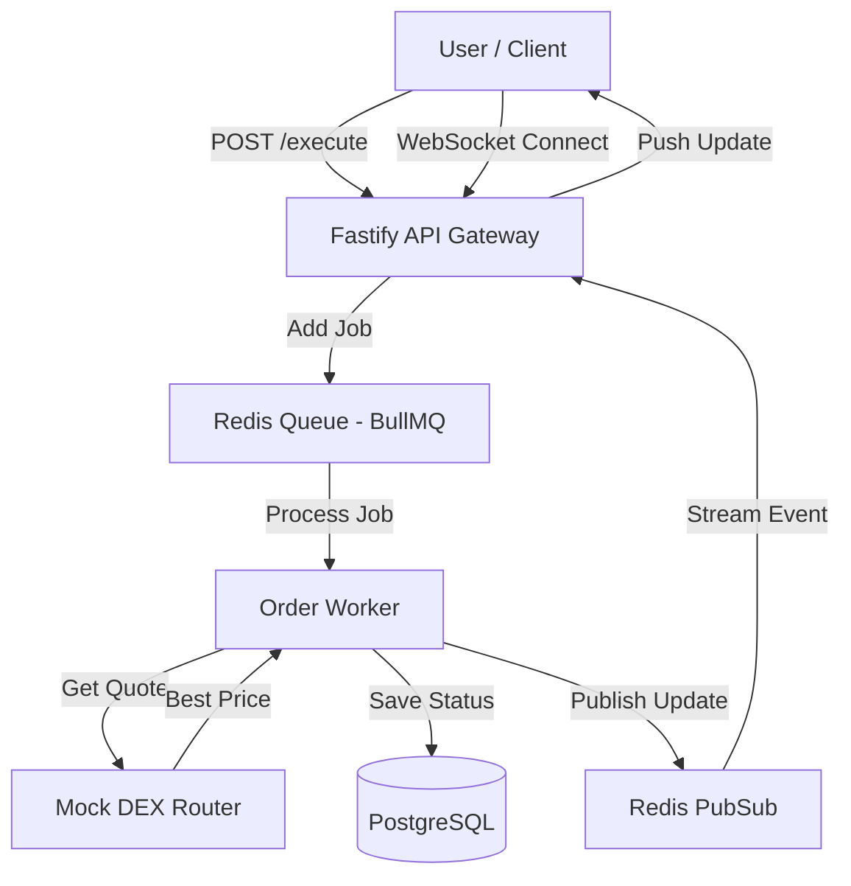

# ⚡ Solana DEX Order Execution Engine


A high-performance, containerized order execution engine that mimics a Solana DEX router. It handles concurrent order processing, routes trades between Raydium and Meteora based on best price, and streams real-time updates via WebSockets.

**Live Demo URL:**  
**Video Walkthrough:** : https://youtu.be/6ReDdJJqqSo

---

## 🏗️ Architecture

The system uses a producer-consumer pattern to handle high-throughput trading without blocking the main API thread.



---

## 🌟 Key Features

*   **Smart Routing:** Automatically checks mocked pools (Raydium vs. Meteora) and routes to the best price/liquidity.
*   **Concurrency Control:** Uses **BullMQ** to limit execution to 10 concurrent orders, protecting against rate limits.
*   **Real-Time Streaming:** Custom WebSocket implementation using Redis Pub/Sub to bridge stateless workers with connected clients.
*   **Dockerized:** Fully isolated environment with internal networking for API, Postgres, and Redis.
*   **Resilient:** Exponential backoff strategies for failed transactions.

---

## 🚀 Quick Start

### Prerequisites
*   Docker & Docker Compose
*   Node.js v18+ (for local testing)

### 1. Setup & Installation
We use a `make.sh` helper to handle the container lifecycle and database migrations.

```bash
# Clone the repo
git clone https://github.com/shashankshri10/solana-dex-engine.git
cd solana-dex-engine

# Make script executable
chmod +x make.sh

# Build containers and run migrations
./make.sh setup
```

### 2. Start the Engine
```bash
./make.sh start
```
*   API: `http://localhost:3000`
*   WebSocket: `ws://localhost:3000/ws`

---

## 🧪 Testing & Demo

### Run the Concurrent Demo
We have included a script that simulates **5 simultaneous users** firing orders to demonstrate the queue and routing logic.

```bash
npx tsx scripts/demo-concurrent.ts
```

### Run Unit Tests
Includes 11 tests covering Router logic, Worker lifecycle, and Input validation.
```bash
./make.sh test
```

### API Endpoints

| Method | Endpoint | Description |
| :--- | :--- | :--- |
| `POST` | `/api/orders/execute` | Submit a Market/Limit order. |
| `GET` | `/api/health` | Check system status. |
| `WS` | `/ws` | Connect for real-time order updates. |

---

## 🧠 Design Decisions

1.  **Why Fastify over Express?**
    *   Fastify provides significantly lower overhead and better async performance, which is critical for high-frequency trading applications.

2.  **Why BullMQ (Redis)?**
    *   Direct HTTP processing would time out under load. A queue allows us to ingest thousands of orders instantly (`pending`) and process them at a controlled rate (`concurrency: 10`), matching the RPC rate limits of Solana nodes.

3.  **WebSocket Architecture**
    *   Since the Worker runs in a separate process/container from the WebSocket server, they cannot share memory. I implemented a **Redis Pub/Sub** pattern where the Worker publishes events (`order-updates`) and the API server subscribes and forwards them to the specific client.

---

## 📂 Project Structure
```text
src/
├── api/             # HTTP Routes
├── services/        # Business Logic (Queue, Router, DB)
├── workers/         # BullMQ Worker Processor
├── models/          # Database Schema (Drizzle)
├── tests/           # Vitest Unit Tests
└── app.ts           # Entry Point
```
